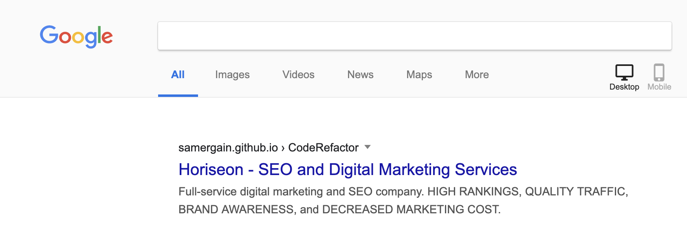
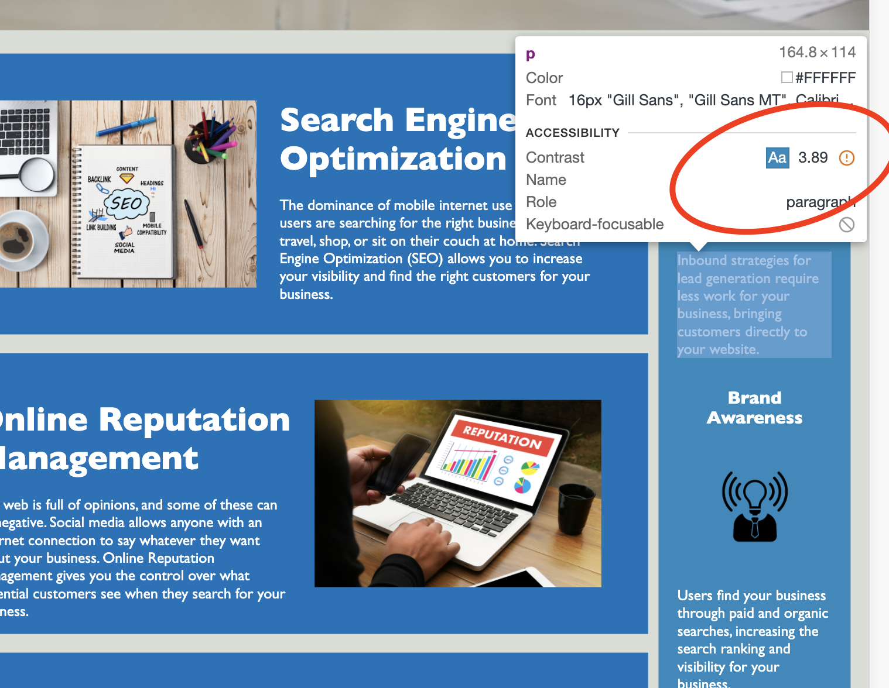

# CodeRefactor
Refactoring an existing webpage to meet SEO and accessibility standards.

## Main Changes
* **index.html** was altered to have **Descriptive Title, Semantic Tags, Alt Attributes on img tags, Clean Headings Structure, Meta Description**
* **style.css** was cleaned to achieve a reduced code with the same output, and slightly altered to match the changes in index.html
* The code was validated with two validation tools for Semantic tags and accessibility
* Snippet tool was used to make sure the page looks good and has the right keywords on google search (screenshot below)

## Tools 
* [WAVE Web Accessibility Evaluation Tool](https://wave.webaim.org/)
* [Markup Validation Service](https://validator.w3.org/)
* [SERP snippet generator](https://serpsim.com/)

## What's Next?
* The side bar needs some work with the text/background contrast ratio (see screenshot below) as it's a little below the standards. Additional instructions added as comments in code.

* Make it compatible with old browsers (IE.6/7/8 and others)
